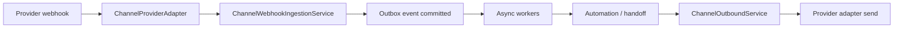

# Channels Guide

Modira treats messaging channels as adapters around one commerce engine. Instagram, WhatsApp Cloud API, Telegram Bot API, Bale Bot API, and Rubika Bot API normalize inbound provider payloads into `NormalizedInboundMessage` and send outbound replies through `NormalizedOutboundMessage`.

**Related docs:** [meta-webhook-setup.md](./meta-webhook-setup.md) (Meta/Instagram webhook setup), [api-documentation.md](./api-documentation.md) (REST routes), [security_configuration.md](./security_configuration.md) (production security).

---

## Adapter contract

All providers follow the same contract:

1. Verify the webhook signature (or provider-specific secret).
2. Normalize provider payloads into a generic message-received event.
3. Enqueue `channel.message.received`.
4. Run automation-first execution.
5. Send outbound replies through the provider adapter.

**Canonical webhook route:** `POST /api/v1/channels/{provider}/webhook`

A compatibility route also exists: `/api/v1/webhooks/{provider}`.

No provider adapter should own order creation, inventory reservation, payment safety, or LLM orchestration logic.

---

## Inbound flow

1. Provider webhook reaches `/api/v1/channels/{provider}/webhook` (or compatibility endpoint).
2. `ChannelProviderAdapter` verifies webhook security and parses the payload.
3. `ChannelWebhookIngestionService` creates or updates channel contact identities, customers, channel conversations, channel messages, and internal messages.
4. An outbox event is committed before async workers publish jobs.
5. `ChannelOutboundService` applies channel policy and sends through a provider adapter.

---

## Execution model

Automation rules, deterministic catalog resolution, order state transitions, and policy gates run **before** any model fallback. LLM fallback is bounded to extraction, classification, or drafting when deterministic logic cannot resolve safely. Risky, ambiguous, policy-sensitive, or customer-impacting actions require preview or human handoff.

Webhook handlers must **not** call LLMs inline.

---

## Credentials and secrets

| Credential type | Scope | Storage |
|-----------------|-------|---------|
| Shop provider tokens (page tokens, bot tokens, phone credentials) | Per shop channel account | Encrypted at rest with `TOKEN_ENCRYPTION_KEY` |
| Global Meta app credentials (`META_APP_ID`, `META_APP_SECRET`) | Platform-wide | Env config; used for signature validation, not shop tokens |

Rules:

- Provider access tokens are never returned in API responses.
- Secrets must be redacted from logs, job payloads, failed jobs, and debug surfaces.
- Production must set a strong `TOKEN_ENCRYPTION_KEY`, keep `WEBHOOK_SIGNATURE_BYPASS=false`, restrict `CORS_ORIGINS`, and avoid frontend provider-token variables.
- Frontend env may contain browser-safe URLs only (e.g. `VITE_API_BASE_URL`).

Webhook payload logs must be masked for PII and secrets. Deduplication keys combine provider, channel account, and external message/update identifiers.

---

## Security and outbound policy

| Provider | Policy notes |
|----------|--------------|
| **WhatsApp** | Customer-service-window awareness; approved templates required outside the session window |
| **Telegram** | Send only to known or allowed bot chats |
| **Bale** | Send only to known or allowed bot chats |
| **Rubika** | Endpoint mode requires HTTPS |
| **Instagram** | Existing policy and safety controls retained |

Outbound sending remains subject to **pilot mode** and **emergency-stop** rules before real provider calls are enabled.

Production deployments must use the strongest available webhook validation for each provider. Do not run with missing or unsafe webhook secrets.

---

## Provider matrix

| Provider | Implementation | Verification status |
|----------|----------------|---------------------|
| Instagram | Existing implementation retained | Mocked/local tests cover parsing and webhook behavior |
| WhatsApp | Implemented | Mocked tests pass; real sandbox verification still required |
| Telegram | Implemented | Mocked tests pass; real sandbox verification still required |
| Bale | Implemented | Mocked tests pass; real sandbox verification still required |
| Rubika | Implemented | Mocked tests pass; real sandbox verification still required |

Mocked tests are **not** a substitute for sandbox validation when real credentials are available.

---

## Onboarding a channel account

1. Open **Channel Accounts** in the admin UI.
2. Choose a provider: Instagram, WhatsApp, Telegram, Bale, or Rubika.
3. Enter provider-specific identifiers and credentials.
4. Save the channel account; credentials are encrypted before storage.
5. Configure the provider webhook URL as `/api/v1/channels/{provider}/webhook`.
6. Use **Webhook test** to confirm the account is visible to the API.

**Provider-specific notes:**

- **WhatsApp:** Configure phone number ID and verify token.
- **Telegram / Bale:** Configure bot token and optional webhook secret.
- **Instagram:** Use OAuth connect flow in admin UI; see [meta-webhook-setup.md](./meta-webhook-setup.md) for Meta app configuration.

Per-account webhook routes also exist for Instagram and Telegram (see [api-documentation.md](./api-documentation.md)).

---

## Pre-pilot verification checklist

Before enabling real provider traffic:

1. Run backend tests and migrations.
2. Run frontend typecheck, lint, test, and build.
3. Run Docker smoke testing (`scripts/verify_local.sh` or equivalent).
4. Validate webhook signatures against each connected provider in sandbox.
5. Confirm pilot mode and emergency-stop behavior for outbound sends.

---

## API quick reference

| Route pattern | Purpose |
|---------------|---------|
| `POST /api/v1/channels/{provider}/webhook` | Canonical inbound webhook (signed) |
| `GET /api/v1/channels/{provider}/webhook` | Meta-style challenge verification |
| `POST /api/v1/shops/{shop_id}/channels/{id}/credentials` | Save encrypted credentials |
| `POST /api/v1/shops/{shop_id}/channels/{id}/webhook-test` | Webhook connectivity test |

Full route tables (OAuth, Telegram connect, Instagram readiness, etc.) live in [api-documentation.md](./api-documentation.md#channels).
